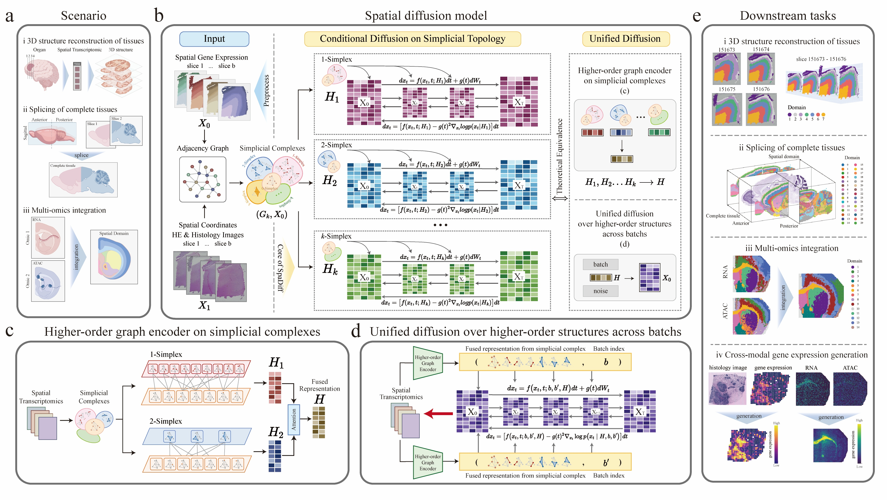

SpaDiff: Topology-aware score-based diffusion modeling for integrating multi-slice and multi-omics spatial data
=================================================================================================================

Biological systems are organized across space and time, yet most spatial omics studies still rely on individual two-dimensional slices that provide only partial views of tissue architecture. As spatial profiling expands to serial slices, multiple conditions, and complementary molecular modalities, there is a growing need for computational methods that can integrate heterogeneous measurements while preserving spatial continuity and tissue topology.
Here we present SpaDiff, a spatial diffusion-dynamics framework for integrating, denoising, and generating multi-slice and multi-omics spatial data. 
SpaDiff represents tissue organization with simplicial complexes, enabling the modeling of higher-order spatial interactions beyond conventional edge-based graphs. It further formulates integration within a unified conditional score-based diffusion framework, in which diffusion processes defined on distinct simplicial complexes are coupled through a spatially constrained stochastic differential equation. 
This formulation enables harmonization across slices and modalities while preserving biologically meaningful spatial structure.
Across 19 spatial transcriptomics datasets from human and mouse tissues, SpaDiff improves cross-slice integration, maintains anatomical consistency, and recovers coherent spatial domains in both serial and non-serial settings. 
SpaDiff also generalizes to spatial multi-omics data, including joint analysis of spatial ATAC-RNA measurements. In HER2-positive breast cancer, SpaDiff supports crossmodal generation of gene expression from histology and identifies candidate prognostic genes.
Together, these results establish SpaDiff as a general framework for reconstructing tissue functional landscapes from complex spatial omics data.

What can SpaDiff do?
--------------------

* **Identify spatial domains on one tissue section.** SpaDiff combines the
  molecular profile of every spot with the topology of its spatial
  neighborhood.
* **Reconstruct a three-dimensional tissue representation.** Consecutive
  sections are connected through within-slice and between-slice neighborhoods
  and embedded in a shared space.
* **Align adjacent sections.** Coordinates are transformed into a
  common frame before SpaDiff learns domains across the completed tissue
  geometry.
* **Integrate paired spatial multi-omics.** Modality-aware diffusion learns
  RNA- and ATAC-specific representations, which are averaged spot by spot for
  measurements obtained at the same locations.

Getting started
---------------

Install SpaDiff and its tutorial dependencies, then choose the workflow that
matches your experiment:

.. code-block:: bash

   git clone https://github.com/xy-geng/SpaDiff.git
   cd SpaDiff
   conda create -n spadiff python=3.9 -y
   conda activate spadiff
   python -m pip install --upgrade pip
   python -m pip install -e ".[tutorial]"

For GPU installations, install the appropriate PyTorch build before the final
command. See :doc:`Installation/install` for complete CPU, CUDA, optional R,
and verification instructions.

.. note::

   The tutorials use full training schedules for reference experiments. Set
   ``training_epochs`` to ``5`` when you only want to verify the data flow and
   installation.

Documentation
-------------

.. toctree::
   :maxdepth: 3
   :caption: Contents

   Installation/index
   tutorial/index

Project links
-------------

* `Source code <https://github.com/xy-geng/SpaDiff>`_
