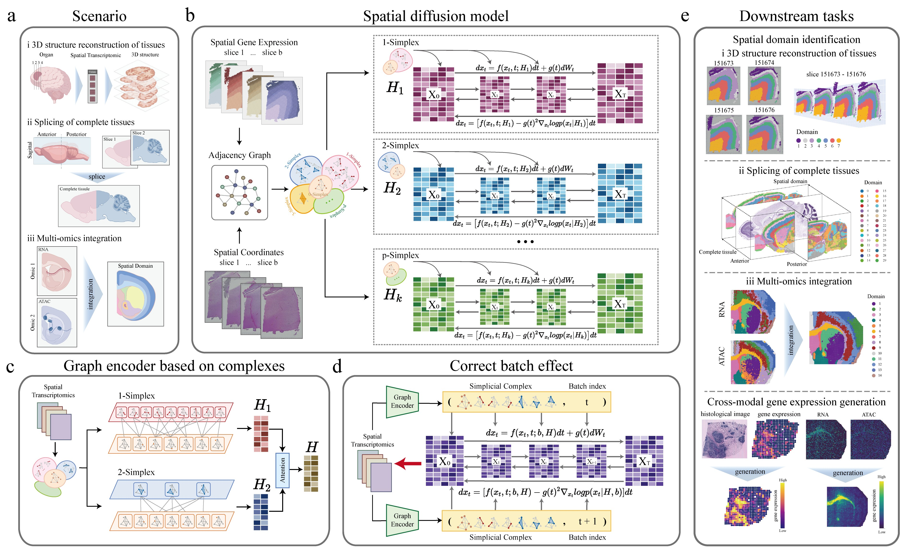

# SpaDiff

Generating spatially coherent tissue structures across spatial multi‑slice multi‑omics data by spatial diffusion dynamics. 

# Abstract 

The rapid growth of spatial transcriptomics (ST) and spatial multi-omics calls for principled methods to integrate multiple tissue sections into a coherent view of tissue organization. Existing approaches are often tailored to single slices or rely on pairwise graph alignment, which can hinder the recovery of global architecture and spatial domains shared across slices. We introduce SpaDiff, a unified spatial diffusion-dynamics framework for multi-slice, multi-omics integration. SpaDiff combines conditional score-based diffusion modeling with higher-order topological representations built from hierarchical simplicial complexes, enabling the model to capture not only local neighborhoods but also multi-node spatial interactions beyond edges. Crucially, we provide a theoretical perspective showing that diffusion processes defined on different simplicial complexes can be consistently unified within a single conditional diffusion model, thereby formulating multi-slice integration as a spatially constrained stochastic differential equation (SDE). Across diverse ST and spatial multi-omics benchmarks, SpaDiff improves batch-effect removal while preserving biologically meaningful variation and the spatial continuity of inferred domains and supports robust alignment of consecutive tissue slices. SpaDiff further enables cross-modal generation of gene expression from histology in breast cancer samples, facilitating the discovery of candidate prognostic genes. Overall, SpaDiff offers a unified system-level framework for modeling spatial functional landscapes from multi-slice, multi-omics tissue data.   

# Getting started

See Documentation and Tutorials.

# Requirements

The dependencies for the codes are listed in requirements.txt

anndata==0.8.0

scanpy==1.9.1

rpy2==3.4.1

numpy==1.24.1

pandas==1.4.2

scikit-learn==1.1.1

torch==2.4.1

